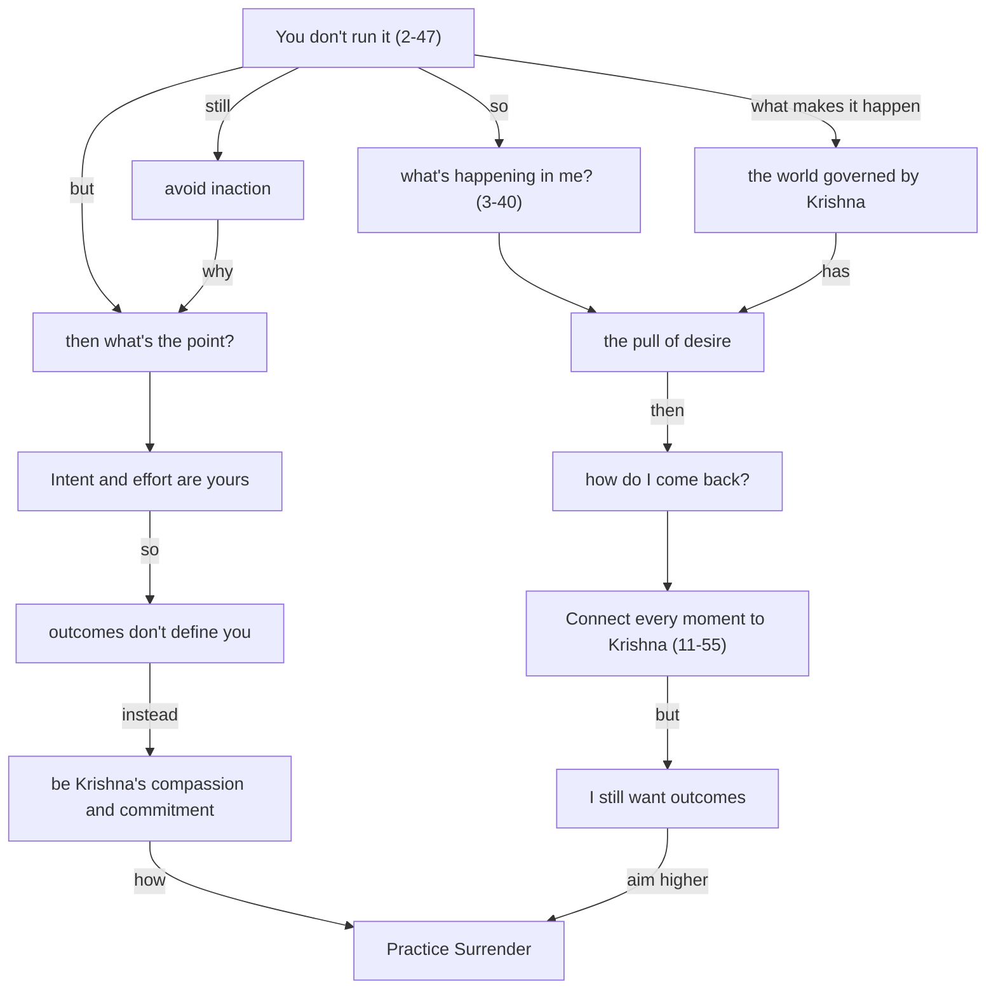

# The morning I realized I don't run the Universe

```mermaid
flowchart TD
    A["You don't run it (2-47)"] -->|what makes it happen| E[the world governed by Krishna]
    A -->|so| C["what's happening in me? (3-40)"]
    A -->|but| D[then what's the point?]

    C --> F[the pull of desire]
    E -->|has| F

    F -->|then| G[how do I come back?]
    G --> H["Connect every moment to Krishna (11-55)"]
    A -->|still| I[avoid inaction]
    I -->|why| D

    D --> J[Intent and effort are yours]
    J -->|so| K[outcomes don't define you]
    K -->|instead| L[be Krishna's compassion and commitment]
    L -->|how| M[Practice Surrender]

    H -->|but| N[I still want outcomes]
    N -->|aim higher| M
```
