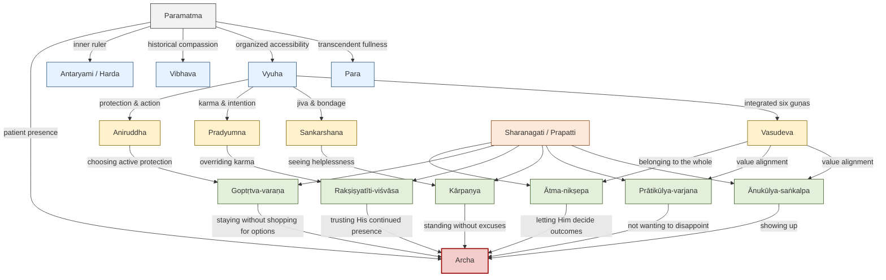

# Paramatma reaches out

```mermaid
flowchart TD

%% =========================
%% COLOR DEFINITIONS
%% =========================
classDef paramatma fill:#f2f2f2,stroke:#333,stroke-width:1px
classDef roopa fill:#e6f2ff,stroke:#1f4e79,stroke-width:1px
classDef vyuha fill:#fff2cc,stroke:#7f6000,stroke-width:1px
classDef sharanagati fill:#fde9d9,stroke:#843c0c,stroke-width:1px
classDef anga fill:#e2efda,stroke:#385723,stroke-width:1px
classDef archa fill:#f4cccc,stroke:#990000,stroke-width:2px

%% =========================
%% PARAMATMA & ROOPAS
%% =========================
A[Paramatma]:::paramatma

A -->|transcendent fullness| B[Para]:::roopa
A -->|organized accessibility| C[Vyuha]:::roopa
A -->|historical compassion| D[Vibhava]:::roopa
A -->|inner ruler| E[Antaryami / Harda]:::roopa
A -->|patient presence| F[Archa]:::archa

%% =========================
%% VYUHA EXPRESSIONS
%% =========================
C -->|integrated six guṇas| C1[Vasudeva]:::vyuha
C -->|jiva & bondage| C2[Sankarshana]:::vyuha
C -->|karma & intention| C3[Pradyumna]:::vyuha
C -->|protection & action| C4[Aniruddha]:::vyuha

%% =========================
%% SHARANAGATI
%% =========================
G[Sharanagati / Prapatti]:::sharanagati

G --> G1[Ānukūlya-saṅkalpa]:::anga
G --> G2[Prātikūlya-varjana]:::anga
G --> G3[Kārpaṇya]:::anga
G --> G4[Rakṣiṣyatīti-viśvāsa]:::anga
G --> G5[Goptṛtva-varaṇa]:::anga
G --> G6[Ātma-nikṣepa]:::anga

%% =========================
%% VYUHA → AṄGA MAPPING
%% =========================
C1 -->|value alignment| G1
C1 -->|value alignment| G2

C2 -->|seeing helplessness| G3

C3 -->|overriding karma| G4

C4 -->|choosing active protection| G5

C1 -->|belonging to the whole| G6

%% =========================
%% AṄGAS RESTING IN ARCHĀ
%% =========================
G1 -->|showing up| F
G2 -->|not wanting to disappoint| F
G3 -->|standing without excuses| F
G4 -->|trusting His continued presence| F
G5 -->|staying without shopping for options| F
G6 -->|letting Him decide outcomes| F
```
