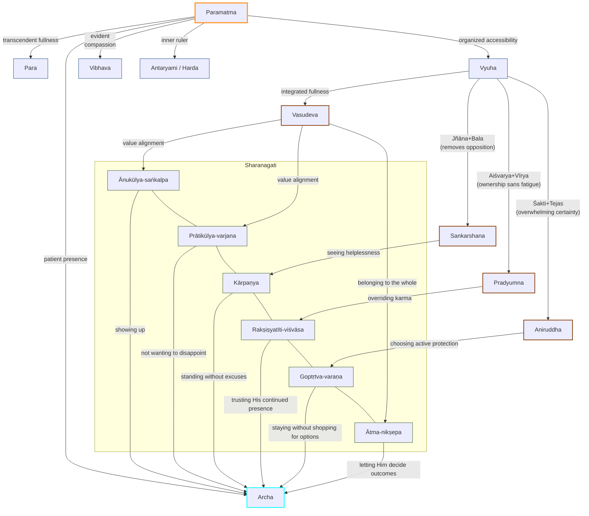

# Paramatma reaches out

```mermaid
flowchart TD

%% =========================
%% COLOR DEFINITIONS
%% =========================
classDef paramatma stroke:#FF9933,stroke-width:3px
classDef roopa stroke:#1f4e79,stroke-width:1px
classDef vyuha stroke:#8B4513,stroke-width:2px
classDef anga stroke:#385723,stroke-width:1px
classDef archa stroke:#00FFFF,stroke-width:2px

%% =========================
%% PARAMATMA & ROOPAS
%% =========================
A[Paramatma]:::paramatma

A -->|transcendent fullness| B[Para]:::roopa
A -->|organized accessibility| C[Vyuha]:::roopa
A -->|evident<br>compassion| D[Vibhava]:::roopa
A -->|inner ruler| E[Antaryami / Harda]:::roopa
A -->|patient presence| F[Archa]:::archa

%% =========================
%% VYUHA EXPRESSIONS
%% =========================
C -->|integrated fullness| C1[Vasudeva]:::vyuha
C -->|"Jñāna+Bala<br>(removes opposition)"| C2[Sankarshana]:::vyuha
C -->|"Aiśvarya+Vīrya<br>(ownership sans fatigue)"| C3[Pradyumna]:::vyuha
C -->|"Śakti+Tejas<br>(overwhelming certainty)"| C4[Aniruddha]:::vyuha

%% =========================
%% SHARANAGATI
%% =========================
subgraph Sharanagati
G1[Ānukūlya-saṅkalpa]:::anga --- G2[Prātikūlya-varjana]:::anga
G2 --- G3[Kārpaṇya]:::anga
G3 --- G4[Rakṣiṣyatīti-viśvāsa]:::anga
G4 --- G5[Goptṛtva-varaṇa]:::anga
G5 --- G6[Ātma-nikṣepa]:::anga
end

%% =========================
%% VYUHA → AṄGA MAPPING
%% =========================
C1 -->|value alignment| G1
C1 -->|value alignment| G2

C2 -->|seeing helplessness| G3

C3 -->|overriding karma| G4

C4 -->|choosing active protection| G5

C1 -->|belonging to the whole| G6

%% =========================
%% AṄGAS RESTING IN ARCHĀ
%% =========================
G1 -->|showing up| F
G2 -->|not wanting to disappoint| F
G3 -->|standing without excuses| F
G4 -->|trusting His continued presence| F
G5 -->|staying without shopping for options| F
G6 -->|letting Him decide outcomes| F
```
