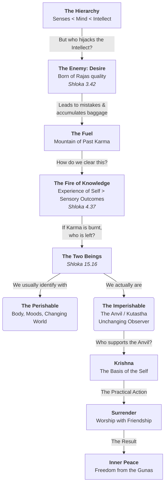

# The Tug-of-War Inside: Finding Your Unchanging Self

```mermaid
graph TD
    %% The Problem Phase
    A[<b>The Hierarchy</b><br/>Senses < Mind < Intellect] -->|But who hijacks the Intellect?| B[<b>The Enemy: Desire</b><br/>Born of Rajas quality<br/><i>Shloka 3.42</i>]
    
    %% The Consequence
    B -->|Leads to mistakes &<br/>accumulates baggage| C[<b>The Fuel</b><br/>Mountain of Past Karma]
    
    %% The Solution Phase
    C -->|How do we clear this?| D[<b>The Fire of Knowledge</b><br/>Experience of Self > Sensory Outcomes<br/><i>Shloka 4.37</i>]
    
    %% The Identity Shift
    D -->|If Karma is burnt,<br/>who is left?| E[<b>The Two Beings</b><br/><i>Shloka 15.16</i>]
    
    E -->|We usually identify with| F(<b>The Perishable</b><br/>Body, Moods, Changing World)
    E -->|We actually are| G(<b>The Imperishable</b><br/>The Anvil / Kutastha<br/>Unchanging Observer)
    
    %% The Ultimate Step
    G -->|Who supports the Anvil?| H[<b>Krishna</b><br/>The Basis of the Self]
    
    H -->|The Practical Action| I[<b>Surrender</b><br/>Worship with Friendship]
    
    I -->|The Result| J[<b>Inner Peace</b><br/>Freedom from the Gunas]
```

